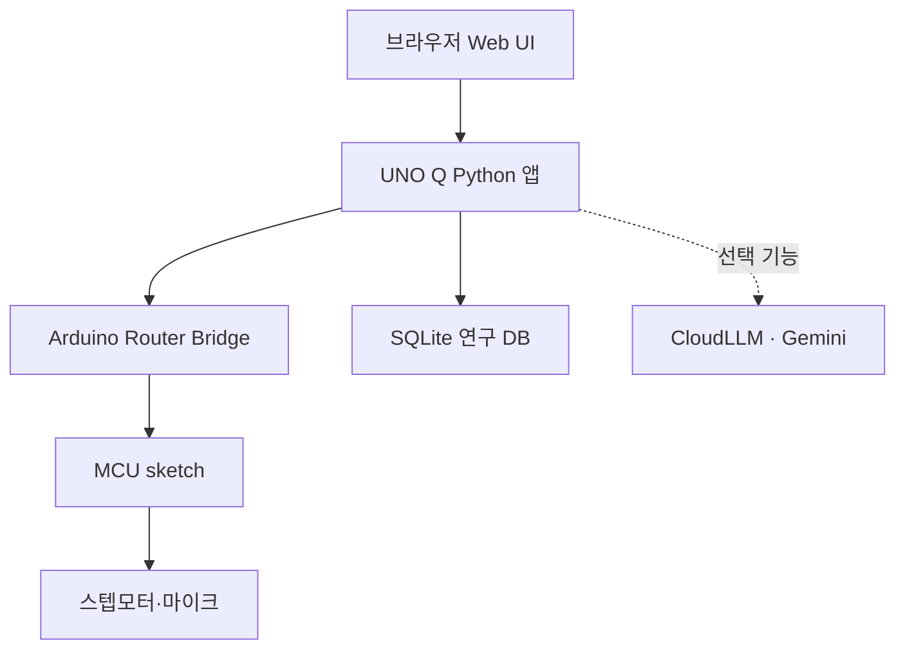

# Open Standing Wave Lab AI

Arduino UNO Q를 이용해 관 내부의 음향 정상파를 자동 측정하고 분석하는 교육용 실험 장치입니다.

스텝모터와 실·도르래로 마이크를 관의 길이 방향으로 이동시키며 마이크 신호의 peak-to-peak 전압(Vpp)을 측정합니다. 웹 화면에서 실시간 그래프를 확인하고, 마디·배 선택 또는 결정론적 곡선 맞춤으로 파장을 구할 수 있습니다. 선택 기능인 AI 챗봇은 현재 실험 설정·측정값·곡선 맞춤 결과를 바탕으로 학생의 질문에 답합니다.

> 이 프로젝트는 물리 수업과 교육 연구를 위한 장치입니다. 정밀 음압계나 절대 위치 측정 장비를 대체하지 않습니다.

## 주요 기능

- Arduino UNO Q MCU에서 모터 이동과 ADC 측정을 실시간 수행
- 시작 위치 또는 1회 이동 후부터 최대 1,000개 측정점 자동 수집
- 평균 Vpp, 표준편차, ADC clipping 의심 여부 계산
- 브라우저 기반 장치 제어, 상태 확인, 표와 실시간 정상파 그래프
- 그래프의 인접한 마디 또는 배를 직접 선택하여 파장 계산
- 비클리핑 측정점 전체에 정상파 모델을 맞추어 파장·마디 간격·음속·R² 계산
- 측정 CSV, 챗봇 대화 CSV, fitting JSON을 하나의 ZIP으로 내보내기·불러오기
- 현재 실험 데이터를 근거로 답하는 선택형 Gemini 실험 챗봇
- 측정·실험 상태·대화·분석·화면 조작을 연구용 SQLite DB에 기록
- 측정 중 정지, MCU 재부팅, 오래된 실험 ID 재사용 등에 대한 데이터 보호

## 시스템 구성



- `sketch.ino`: 모터 제어, ADC Vpp 측정, 결과 버퍼, 안전 상태 관리
- `main.py`: MCU 통신, 영속 저장, fitting, 실험 ZIP, 챗봇
- `index.html`: 실험 설정, 제어, 그래프, 표, 내보내기·불러오기, 챗봇 UI
- `activity_log.py`: 연구용 SQLite 스키마와 기록 처리
- `activity_log_api.py`: 활동 기록 API 등록

## 준비물

| 구분 | 설명 |
| --- | --- |
| 제어 보드 | Arduino UNO Q |
| 위치 이동 | 4선 스텝모터, ULN2003 드라이버, 실·도르래, 이동식 마이크 지지대 |
| 소리 측정 | 0~3.3 V 범위의 아날로그 마이크 센서 모듈 |
| 정상파 형성 | 공명관, 스피커 또는 별도의 진동수 발생 장치 |
| 기구물 | 마이크 시작 위치 표시, 관 및 모터 고정 구조, 자 또는 위치 보정 도구 |
| 소프트웨어 | Arduino UNO Q App 환경과 웹 브라우저 |
| 선택 사항 | AI 챗봇용 Arduino CloudLLM 설정과 API 키 |

모터 전원은 사용하는 모터와 드라이버의 사양에 맞게 공급하십시오. 모터를 UNO Q의 GPIO에 직접 연결하지 말고 드라이버를 사용해야 합니다.

## 배선

| UNO Q 핀 | 연결 | 비고 |
| --- | --- | --- |
| `A0` | 마이크 센서 아날로그 출력 | 입력 범위는 반드시 0~3.3 V |
| `D8`~`D11` | ULN2003 제어 입력 | 현재 `Stepper` 초기화 순서는 `11, 9, 10, 8` |
| `GND` | 마이크·모터 드라이버 공통 GND | 모든 장치의 기준 전위를 공통으로 연결 |

모터의 실제 회전 방향은 결선과 기구 배치에 따라 달라질 수 있습니다. 먼저 JOG 기능으로 정방향이 관을 따라 측정하는 방향인지 확인하십시오.

## 저장소 구조

GitHub 저장소에는 파일을 다음과 같이 배치합니다.

```text
.
├── app.yaml
├── assets/
│   └── index.html
├── python/
│   ├── main.py
│   ├── activity_log.py
│   └── activity_log_api.py
└── sketch/
    ├── sketch.ino
    └── sketch.yaml
```

실행 중 생성되는 `data/`, SQLite DB, 측정 결과, API 키는 저장소에 올리지 마십시오.

권장 `.gitignore` 항목은 다음과 같습니다.

```gitignore
data/
*.sqlite3
*.sqlite3-journal
*.sqlite3-wal
*.sqlite3-shm
__pycache__/
*.py[cod]
.env
```

## 설치 및 실행

1. 위 구조대로 파일을 배치하고 Arduino UNO Q의 App 환경에서 프로젝트를 엽니다.
2. `sketch.yaml`의 기본 프로필과 `Stepper (1.1.3)` 라이브러리를 확인합니다.
3. MCU sketch와 Python 앱을 빌드·배포합니다.
4. AI 챗봇을 사용할 경우 `app.yaml`의 CloudLLM Brick에 `API_KEY`를 안전하게 설정합니다. 키 값을 Git에 커밋하지 마십시오.
5. UNO Q 운영체제의 날짜·시각·시간대를 확인합니다. 서버 타임스탬프는 이 시스템 시간대를 사용합니다.
6. 앱의 Web UI를 브라우저에서 엽니다.

Python 코드가 직접 사용하는 `csv`, `json`, `sqlite3`, `threading` 등은 표준 라이브러리입니다. `arduino.app_utils`, `WebUI`, `CloudLLM`은 UNO Q App 실행 환경에서 제공합니다.

AI 초기화에 실패해도 모터 제어, 측정, 그래프와 결정론적 fitting은 계속 사용할 수 있습니다. 현재 챗봇 모델은 `google:gemini-3.5-flash-lite`로 지정되어 있습니다.

## 새 실험 절차

1. 스피커에서 실험할 진동수의 소리를 발생시킵니다.
2. Web UI에서 진동수, 관 길이·종류, 실험실 온도, 1회 이동 거리, 마지막 회차를 입력합니다.
3. 필요한 이전 결과를 먼저 ZIP으로 저장한 뒤 **측정 데이터 초기화**를 누릅니다.
4. 데이터가 비어 있는 상태에서 JOG를 이용해 실의 장력을 조절합니다.
5. 마이크를 기구의 시작 표시선에 수동으로 맞춥니다.
6. **시작 위치 확인**을 누릅니다. 이 동작은 모터를 움직이지 않고 현재 위치를 기준점으로 승인합니다.
7. **측정 시작**을 누르고 실시간 그래프와 상태를 확인합니다.
8. 측정이 끝나면 마디·배를 직접 선택하거나 **파장 계산하기**를 실행합니다.
9. **실험 세트 저장(ZIP)**으로 측정값, 대화와 fitting 결과를 보관합니다.

자동 원점 복귀 기능이나 리미트 스위치는 없습니다. 새 실험마다 마이크를 시작 위치로 직접 되돌려야 합니다.

## 현재 측정 알고리즘

한 회차의 기본 동작은 다음과 같습니다.

1. 첫 회차를 시작 위치에서 측정하거나, 설정에 따라 먼저 이동합니다.
2. 이후 회차마다 스텝모터를 `197 step` 이동합니다.
3. 이동 후 `500 ms` 동안 진동이 가라앉기를 기다립니다.
4. `200 ms` 구간의 Vpp를 10회 측정합니다.
5. 10개 값 중 최댓값 1개와 최솟값 1개를 제외합니다.
6. 남은 8개 값의 평균과 표본표준편차를 저장합니다.

현재 주요 상수는 다음과 같습니다.

| 항목 | 값 |
| --- | ---: |
| 자동 측정 모터 속도 | 20 RPM |
| 수동 JOG 속도 | 10 RPM |
| 회차당 모터 이동 | 197 step |
| 이동 후 안정화 | 500 ms |
| Vpp 측정 구간 | 200 ms × 10회 |
| ADC 해상도 | 10 bit |
| ADC 환산 기준 | 3.3 V / 1024 count |
| clipping 의심 기준 | ADC ≤ 5 또는 ADC ≥ 1018 |
| 최대 저장 회차 | 1,000회 |
| JOG 통신 watchdog | 1.5 s |

기구의 도르래 지름과 실의 미끄럼·신장에 따라 `197 step`의 실제 이동 거리가 달라집니다. Web UI의 **1회 이동당 추정 거리**는 자로 실측해 보정하십시오.

## 파장 분석

### 두 점을 이용한 계산

그래프에서 서로 이웃한 같은 종류의 두 점, 즉 마디 두 개 또는 배 두 개를 선택합니다. 두 점 사이 거리를 `d`라고 하면 파장은 다음과 같이 계산됩니다.

$$
\lambda = 2d
$$

### 전체 데이터 곡선 맞춤

Python 코드는 clipping 의심점만 제외하고 비클리핑 측정점 전체에 다음 모델을 동일 가중치로 맞춥니다.

$$
V_{pp}(x)=B+A\left|\sin\left(\frac{2\pi x}{\lambda}+\phi\right)\right|
$$

결과에는 파장 $\lambda$, 마디 간격 $\lambda/2$, baseline, amplitude, 위상, R²가 포함됩니다. 진동수 $f$가 입력되어 있으면 음속도 계산합니다.

$$
v=f\lambda
$$

보정된 비클리핑 데이터가 8개 이상 있어야 fitting을 실행할 수 있습니다. 기본진동처럼 측정 구간에서 반복되는 마디나 배가 충분히 나타나지 않으면 R²가 높더라도 파장 식별이 불안정할 수 있습니다.

## AI 실험 챗봇

챗봇은 매 질문마다 다음 정보를 최신 스냅샷으로 전달받습니다.

- 관 종류·길이, 실험실 온도, 설정 진동수와 이동 거리
- 현재 측정점 전체와 clipping 표시
- 결정론적으로 계산한 fitting 결과
- 최근 질문·답변 6턴

전체 실험 스냅샷은 대화 메모리에 반복 저장하지 않습니다. 학생에게는 쉬운 설명을 우선하고, 현재 데이터로 확인할 수 없는 수치를 임의로 만들지 않도록 시스템 지침을 구성했습니다.

챗봇은 보조 설명 도구입니다. 측정값과 결정론적 fitting 결과를 우선하여 해석하십시오.

## 데이터 저장

### 현재 측정 상태

UNO Q의 사용자 데이터 경로에 다음 파일이 생성됩니다. 일반적인 경로는 `/home/arduino/.uno_q_standing_wave/`입니다.

- `measurements.json`: 현재 측정 데이터
- `measurements.csv`: 현재 측정 데이터의 표 형식 복사본
- `config.json`: 실험 설정
- `session.json`: MCU 부팅 세션 정보
- `archive/`: MCU 재부팅이나 회차 불일치 때 보존한 이전 측정값

### 연구용 SQLite DB

앱의 `data/standing_wave_activity.sqlite3`에는 다음 항목이 누적됩니다.

- 브라우저 `session_id`와 실험 `experiment_id`
- 완료된 모든 측정 회차와 설정
- 실험 시작·중단·완료·초기화 상태
- 학생과 챗봇의 질문·답변
- fitting 결과
- 버튼, 입력, 그래프 선택 등 Web UI 활동

분석에 자주 사용하는 뷰는 다음과 같습니다.

| 뷰 | 용도 |
| --- | --- |
| `research_measurements` | 실험 설정과 측정값을 결합한 분석 자료 |
| `chat_transcript` | 실험별 학생·챗봇 대화 |
| `activity_timeline` | 세션·실험별 화면 조작 시간선 |
| `experiment_overview` | 실험별 측정·대화·활동 개수 요약 |
| `experiment_state_timeline` | 실험 상태 변화와 당시 MCU 상태 |

DB는 SQLite `DELETE` rollback-journal 모드와 `synchronous=EXTRA`를 사용합니다. 일관된 복사본을 얻으려면 앱을 중지한 뒤 DB 파일을 복사하십시오. 실행 중 잠깐 생성되는 `standing_wave_activity.sqlite3-journal` 파일은 복구에 필요하므로 강제로 삭제하지 마십시오.

### 시간대와 기존 DB

- 새 타임스탬프는 서버 또는 브라우저 컴퓨터의 현재 시간대를 사용하며 UTC 오프셋을 함께 저장합니다.
- SQLite 시간 열은 `server_time_local`, `client_time_local`, `saved_at_server_local`처럼 `*_local` 이름을 사용합니다.
- 기존 UTC 스키마 DB는 자동 마이그레이션하지 않습니다. 이전 DB를 백업한 뒤 앱의 `data/` 밖으로 옮기거나 삭제하고 새 DB로 시작하십시오.

## 실험 ZIP

Web UI가 생성하는 ZIP에는 다음 세 파일이 들어 있습니다.

- `standing_wave_*Hz_*cm.csv`: 측정값과 실험 설정
- `standing_wave_*Hz_*cm_chat.csv`: 학생·챗봇 대화
- `standing_wave_*Hz_*cm_fit.json`: 실험 메타데이터와 fitting 결과

ZIP 불러오기는 기존 실측 행을 덮어쓰지 않고 새 `experiment_id`를 사용합니다.

## 안전 및 알려진 제한 사항

- 자동 원점 복귀와 리미트 스위치가 없습니다. 이동 범위를 물리적으로 확인한 뒤 실행하십시오.
- JOG는 데이터가 없는 새 실험에서만 사용하십시오.
- 회차 도중 정지하면 마이크가 일부 이동했을 수 있어 위치 대응이 무효가 됩니다. 데이터를 초기화하고 시작 위치를 다시 맞추십시오.
- 정지 상태에서는 D8~D11을 LOW로 만들어 모터 코일을 해제합니다.
- 마이크 입력은 0~3.3 V 범위를 벗어나면 안 됩니다.
- Vpp는 마이크 모듈 출력 전압의 변화 폭이며 보정된 절대 음압이 아닙니다.
- 실·도르래로 계산한 위치는 보정된 추정값이며 절대 위치가 아닙니다.
- 외부 스피커의 진동수와 음량은 이 앱이 직접 제어하지 않습니다.

## 개인정보 및 연구 윤리

SQLite DB에는 학생의 입력, 질문, 챗봇 답변과 화면 조작이 평문으로 저장됩니다. 학생 이름 등 개인정보를 입력할 가능성이 있다면 연구 참여 안내·동의, 접근 권한, 보관 기간과 삭제 절차를 먼저 정하십시오.

GitHub에 공개하기 전에는 반드시 다음을 확인하십시오.

- `data/`와 모든 SQLite 파일 제거
- 측정 JSON·CSV·ZIP 및 로그 제거
- API 키와 기타 인증 정보 제거
- 학생 질문·답변이나 식별 가능한 자료가 포함되지 않았는지 확인

## 라이선스

현재 소스 묶음에는 라이선스가 지정되어 있지 않습니다. 다른 사람이 코드와 설계 자료를 재사용하도록 허용하려면 목적에 맞는 `LICENSE` 파일을 저장소에 추가하십시오.

